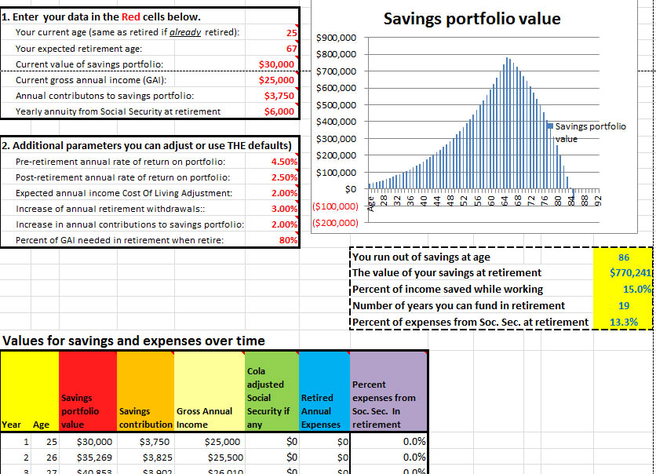

<title>personal finance spreadsheets</title>

<h1><B>Simplified Income-Stream Planning Tool</B> or <B>SIPT</B> </h1>

<table>
<tr>
<td>

<b>Notice:</b> The following spreadsheets are all under 
<A HREF="ForeverBetaCartoon.jpg"> <i>Beta-level</i></A> development <A HREF="https://en.wikipedia.org/wiki/Software_release_life_cycle">**</A>

</TD>
</TR>
</Table>

The <B>Simplified Income-Stream Planning Tool</B> or <B>SIPT</B> is an Excel spreadsheet that calculates a personal finance Glide-Path of cash-flows from yearly income streams subtracting expenses and taxes. This spreadsheet, a collection of worksheets, estimates yearly income from various sources: work, Social Security, pensions, annuities, and insurance; contributions and withdrawals from deductable retirement accounts (IRA, 401(k), etc.,), Roth IRAs and savings investment accounts. Contributions and withdrawals can be specified for the investment and expense accounts. These can be entered as  <b>scheduled</b> (i.e., periodic) or <b>irregular</b> (upcoming additional expeness - e.g., trip around the world, new house, new car, etc.), or both. The spreadsheet then estimates yearly federal tax rates, cash flows, and investment account balances as they grow. The results are presented as tables and glide-path graphs.To use the spreadsheet, you enter your current static data in the <b>red</b> cells in the data entry worksheets. You will also enter your ages, static estimates of the stock bond and cash returns, CPI, COLAs, etc. It will estimate future values in the various accounts. The  <b>Demo</b> version of the spreadsheet contains <i>demonstration</i> data examples exercising all options. The <b>User</b> version has no demonstration data and is the version you might use to enter your data. You might review the <A HREF="SIPT-Introduction.pdf"><B>SIPT-Introduction (PDF)</B></A> first worksheet of the SIPT that describes how to use the spreadsheet (or download the spreadsheet itself and read the <B>Introduction</B> worksheet there).  

<B>DOWNLOAD</B> 
You can download individual Excel files by clicking on the links of particular files in the following spreadsheets descriptions. After clicking on a particular spreadsheet hyperlink, click on the <B>Download</B> button to download the Excel spreadsheet file to wherever your computer saves downloaded files (e.g., "download" directory on Windows, etc.,).
To edit and save your data, your version of Excel on your computer may require you to click on "Enable Editing" if it says "Protected View" at the top of the screen when you start the spreadsheet.

      
 

<table BGCOLOR="blue">
<tr>
<td>

<DL>
<DT>Full Demonstration Data
<DD>
<UL>
<LI><A HREF="SIPT-Demo-V.0.24.17-08-22-2016a.xlsx">
<B>SIPT-Demo-V.0.24.17-08-22-2016a.xlsx</B></A>
<LI>The full version demonstrates examples of typical user data for all data entry worksheets. In addition to demonstrating the spreadsheet, it may be useful for seeing examples of typical answers.
</UL>
</DT>

<DT>User Entered Data
<DD>
<UL>
<LI><A HREF="SIPT-User-V.0.24.17-08-22-2016a.xlsx">
<B>SIPT-User-V.0.24.17-08-22-2016a.xlsx</B></A>
<LI>The User version of the spreadsheet has no data and is useful for entering your own data.
</UL>
</DT>
</DL>

</td>
</tr>
</table>
      
			
<B>SUMMARY:</B> 
			
This Excel spreadsheet is a planning tool for people who want to plan for future saving and spending needs, want to get rough estimates of their saving and spending patterns over time. You must be willing to enter <I>summaries</I> of a wide range of your personal financial data required  by the model. These include applicable investments (taxable and retirement), pension, Social Security, work,  annuity, and expenses. The final results are shown in summary tables and glide-path  graphs of those tables. All data are entered  and calculations done only in this spreadsheet. No data are exported or saved from the spreadsheet (either locally or to the Internet). Once the data is entered, the spreadsheet estimates yearly cash-flows using income from various sources: Work,  Pensions, Social Security, Annuities, and Life Insurance benefits; contributions and withdrawals from tax-deferred 401(k), 403(b), 457(b), IRAs, Roths and Savings investment accounts. It estimates yearly investment returns and taxes on investment  returns, expenses. Next it estimates yearly Federal tax rates and resulting cash-flows. It allows for scheduled and irregular (upcoming additional) contributions and withdrawals for investment accounts (IRA, Roth, Savings) as well as scheduled and irregular expenses and deductions. From all this data, it then calculates yearly net worth.  The glide-paths it creates can be useful for investigating different planning scenarios by your making changes to your inputs and seeing how that affects the results with the goal of making the glide-path more sustainable.

It can be run in a variety of spreadsheet programs such as Windows Excel, the free OpenOffice or LibreOffice "calc", Google "sheet", etc. since it doesn't use Microsoft Visual Basic because VBA may not be available in all spreadsheet programs. Apple's "numbers" spreadsheet program has some incompatibilities, so use one either Excel for Mac or one of the free spreadsheet programs. 

So why model? Although all models will be inaccurate, having a rough estimate of your income stream can be useful for financial planning purposes. The spreadsheet is a compromise between complexity and completeness and leans in the direction of a simpler static model. As statistician George Box noted "All models are wrong, but some are useful". To illustrate the concept of glide-path modeling, a very crude glide-path calculator, "SimpleCalc", is available to demonstrate the concept. This may be useful for you to experiment with to better understand the concept of  glide-path before using the full SIPT spreadsheet that uses a much more complete financial planning model.  It is an educational tool. 

<B>VERSION:</B> V.0.24.17-08-21-2016a <I>Beta</I>. <B>See Appendix D</B> 
in spreadsheet for latest status and Revision-Notes History.  			
			

<li> The <a href="SimpleCalc-V.0.4.1-08-21-2016a.xlsx">
<B>SimpleCalc-V.0.4.1-08-21-2016a.xlsx</B></a> spreadsheet calculates an elementary retirement glide-path analysis that lets you look at your finances over time. You enter a few required parameters and it computes a table of savings over time. The table data is also is also plotted as a glide-path graph as shown in the following screen shot. When you retire, it subtracts an inflation adjusted percentage of your earlier income and estimates when you run out of money. It will add your Social Security annuity income when you retire and stop your work income. This spreadsheet is the same as the <i>SimpleCalc</i> worksheet included in the SIPT spreadsheet above and is offered as separate spreadsheet for convenience. You enter your data in the <b>red</b> cells overwriting the existing demonstration data. 
<B>VERSION:</B> V.0.4-0.4-08-05-2016a <I>Beta</I>.  

</li>
</ol>

<h1>Additional Personal Finance Excel Spreadsheets</h1>

Here are a few additional spreadsheets that may be useful. They are <I>not</I> part of the SIPT spreadsheet.

<li> The <a href="Generic-Internal-RateOfReturn-2006-2015-rev.08-05-2016a.xlsx">
<B>Generic-Internal-RateOfReturn-2006-2015-rev.08-05-2016a.xlsx</B></A>
spreadsheet estimates the 10 year (2005-2015) Internal Rate of Return (IRR) of an investment portfolio and compare it to that of a Total Markets Portfolios IRR corresponding to your personal asset allocation.  
<B>VERSION:</B> 0.4 Beta, 8-05-2016

  

</li>

<li> The <a href="SpendableNetWorth-2015-V.4-08-05-2016.xlsx">
<B>SpendableNetWorth-2015-V.4-08-05-2016.xlsx</B></a> 
spreadsheet estimates how much your invested assets are worth as spendable assets (i.e. after taxes). You can estimate this three ways: 1) if the assets are sold slowly over a lifetime; 2) you may optionally sell some of your assets from your taxable investment, tax-deferred IRA or Defined Contribution (DC) plan (above the RMD amount) accounts; and alternatively, 3) you can liquidate all of your assets in one year putting you into a higher tax bracket.   
<B>VERSION:</B> 0.5.4 Beta, 8-05-2016

</li>

<li> 
The <a href="Chained-CPI-U-calculation-V.4-08-05-2016.xlsx">
<B>Chained-CPI-U-calculation-V.4-08-05-2016.xlsx</B></a>
spreadsheet estimates the effect of changing the Social Security COLA from CPI-W to the Chained-CPI-U. It could also be used for estimating the effect of using in the CPI-E (elderly) that has been proposed from time to time.   
<B>VERSION:</B> 0.4, 8-05-2016. 

</li></ol>

<pre></pre>
<table BGCOLOR="yellow">
<tr>
<td>
<b>Disclaimer:</b> The software attempts to compute various personal finance estimates using simplified models. No claim is made to the accuracy, suitability, and correctness of the algorithms. Note, estimates become less accurate over time. As the software uses static models and static rates of return, CPI, etc., it will not track actual market values over time. The software	uses only Excel formulas and <I>does not use Visual Basic (VBA)</I>, so one can easily review all computations as desired. Because it uses generic spreadsheet coding (with no VBA), it will run in a variety of spreadsheet programs such as Windows Excel, free OpenOffice or LibreOffice "calc", free Google"sheet", etc. <B>Use this software at your own discretion and risk,</B> as an initial way to think about personal finance problems. This is educational software. Absolutely no warrantee is offered for this software and no responsibility is taken for any errors in. or use of the software. 
</td>
</tr>
</table>

----------

<address>
<B>Revised:</B> August 22, 2016
 
<B>License:</B> GNU General Public License, version 3.0 (GPLv3) at
[http://opensource.org/licenses/gpl-3.0.html](http://opensource.org/licenses/gpl-3.0.html)
  
<b>Web:</B> [https://github.com/SIPT2016/SIPT](https://github.com/SIPT2016/SIPT)
 
<B>E-mail:</B> <A HREF="mailto:finPlan.SIPT@gmail.com">finPlan.SIPT@gmail.com</A>

</address>
